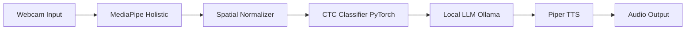
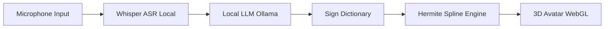
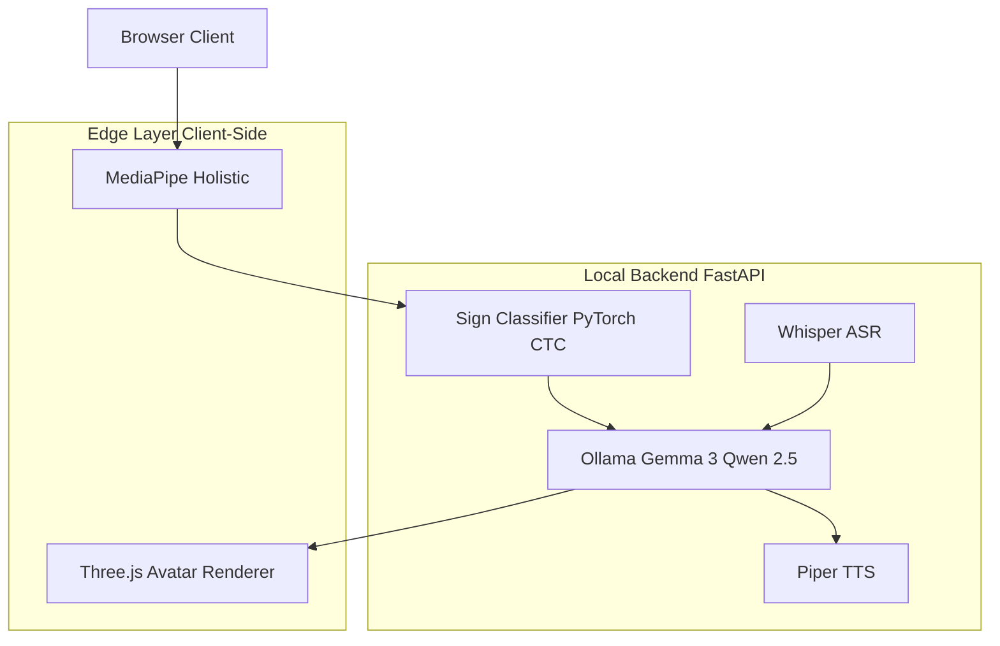

# LSC-SignLLM

**Multimodal Translation System for Colombian Sign Language (LSC)**  
Local LLMs - Edge Computer Vision - Offline Speech Synthesis - 3D Avatar

> A 100% offline, privacy-first system bridging communication barriers between deaf and hearing communities in Colombia.

---

## Overview

**LSC-SignLLM** is an open-source, privacy-preserving translator for Colombian Sign Language (Lengua de Senas Colombianas - LSC).

All processing runs **locally on-device** using Edge AI and Local Large Language Models (LLMs). No video, audio, or personal data is ever sent to external servers.

---

## System Architecture

### Sign-to-Speech Pipeline

### Speech-to-Sign Pipeline

### Full Stack Overview

---

## Tech Stack

| Layer | Technology | License |
|:------|:-----------|:--------|
| Vision / Landmark Extraction | MediaPipe Holistic | Apache 2.0 |
| Sign Classifier | PyTorch + CTC Loss | BSD |
| Language Translation | Gemma 3 4B / Qwen 2.5 via Ollama | Gemma / Apache 2.0 |
| Speech Transcription | Whisper (local) | MIT |
| Speech Synthesis | Piper TTS | MIT |
| Backend API | FastAPI | MIT |
| 3D Avatar Renderer | Three.js (WebGL) | MIT |
| Training Dataset | LSC70 - Universidad del Cauca | CC BY 4.0 |

---

## License

This project is open-source and licensed under the **Apache License 2.0**.  
All integrated datasets and models are verified for commercial use.

---

*Built to empower Colombian Sign Language communication - bringing state-of-the-art AI to the edge.*
